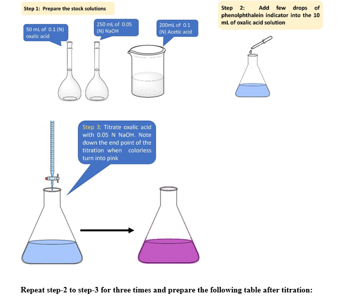
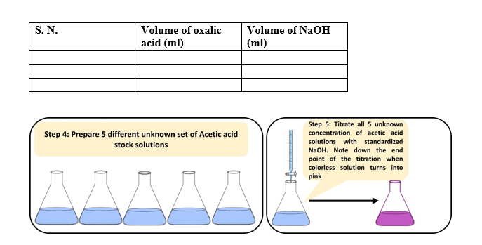
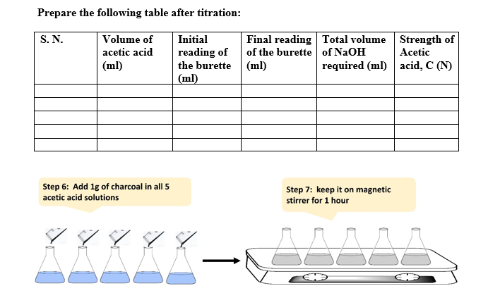
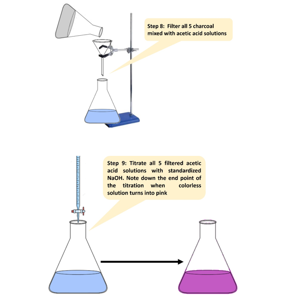
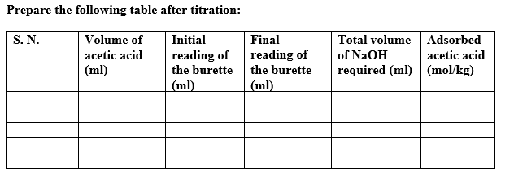
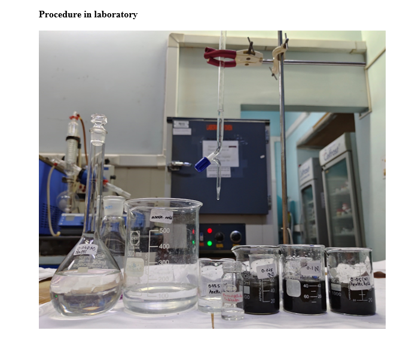
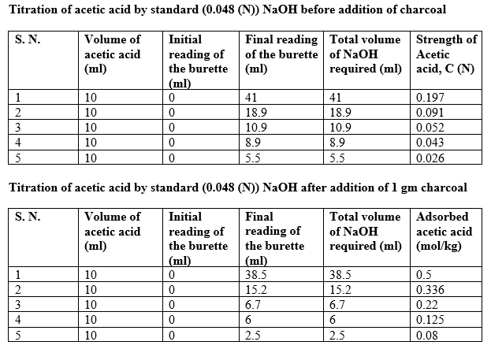
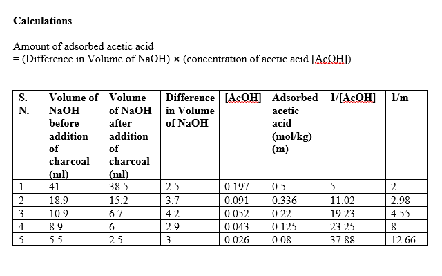
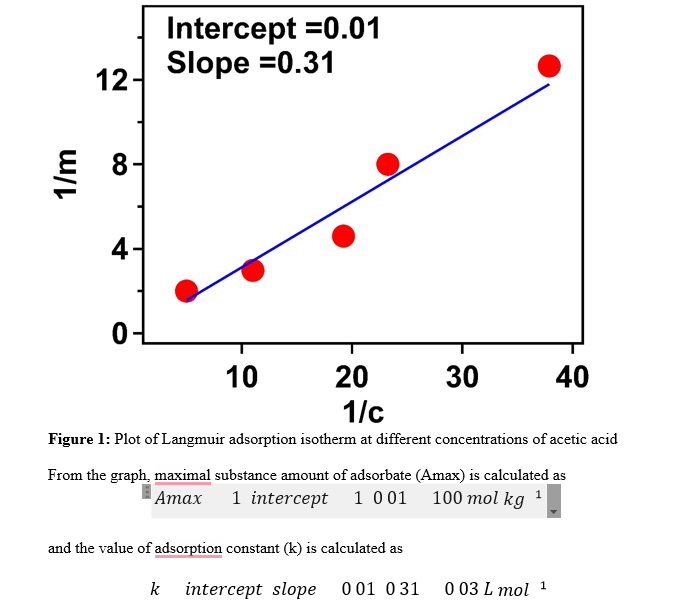

<b>Materials & Reagents Required: </b>  
1)	Activated Charcoal
2)	Glacial Acetic Acid
3)	Conical flask (100 mL) 
4)	Measuring Cylinder (10 mL)
5)	Weighing balance 
6)	Dropper 
7)	Macro pipette (5 mL) 
8)	Burette (50 mL)
9)	Sodium hydroxide  
10)	Oxalic Acid (0.1 N)
11)	Phenolphthalein indicator  

 
<b>Figure 1. </b>  
 
<b>Figure 2. </b>  
 
<b>Figure 3. </b>  
 
<b>Figure 4. </b>  
 
<b>Figure 5. </b>  
 
<b>Figure 6. </b>  
<!-- 
 
 

